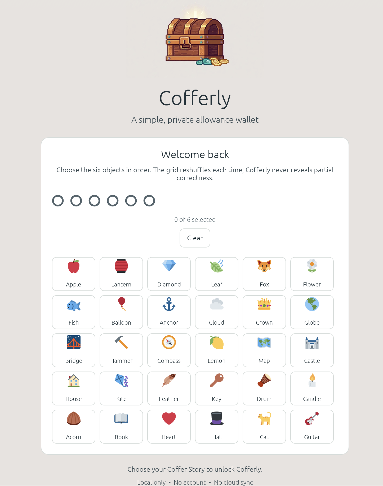

# Cofferly

Cofferly is a small Windows-friendly Rust desktop app for tracking money held for kids.

Parent Coffer Story unlock:



Unlocked wallet ledger:


Parent settings:


Cofferly starts with two neutral child wallets. Each wallet keeps a local ledger of deposits and deductions, similar to a handwritten allowance sheet:

- Starting balance
- Money added
- Money spent
- Description for each entry
- Date
- Automatic running balance
- Coffer Story parent unlock
- Printable ledgers
- Custom child wallet names
- Local encrypted data file

## Download

For a local build, the Windows executable is:

```text
target\release\Cofferly.exe
```

For a portable release zip:

```powershell
.\scripts\package-windows.ps1 -Version 0.1.0
```

The zip will be created in `dist/`.

## Coffer Story

Cofferly opens to a Coffer Story screen so kids cannot add, remove, rename, or print entries without a parent unlocking the app first.

Cofferly generates a sequence of six distinct objects from a stable set of 30. Write the sequence down (or print a recovery card) and store it away from the computer, then confirm it by choosing the objects in order from the shuffled grid. Cofferly deliberately generates the story rather than allowing a human-chosen sequence.

The story is also the input used to encrypt the local data file. Six ordered, distinct objects from 30 provide 427,518,000 possible sequences (about 28.7 bits). This is a substantial improvement over a four-digit PIN, but it does not protect against someone watching the objects as they are entered.

There is no local bypass: if both the story and recovery copy are lost, the encrypted ledger cannot be recovered. Existing installations with a PIN display a clearly labeled Legacy PIN screen and require Coffer Story enrollment after successful unlock.


## Child Wallets

Cofferly starts with `Child 1` and `Child 2` so the public app does not include anyone's real names.

After unlocking parent mode, open **Settings** to rename the selected wallet, update its starting balance, add another child wallet, or delete a wallet. Wallet deletion uses a confirm/cancel step and keeps at least one wallet available.

Use **Remove latest entry** in Settings to undo the most recent ledger entry for the selected wallet. The app offers a short undo window before the next change.

## Printing

Use **Print this wallet** to print the selected child's ledger, or **Print all wallets** to print every child wallet together.

Cofferly writes a temporary printable HTML file (in your OS temp folder) and opens it in your browser. Previous print files are cleaned up when the app starts.

## Windows Installer

The repository includes an Inno Setup script at `installer/Cofferly.iss`.

Build the release executable first:

```powershell
cargo build --release
```

Then open `installer/Cofferly.iss` in Inno Setup and compile the installer. The installer output is written to `dist/`.

## Development

Install Rust from [rustup.rs](https://rustup.rs), then run:

```powershell
cargo run
```

To create a release build:

```powershell
cargo build --release
```

The app stores data locally in your operating system's app data folder.

Data files are encrypted at rest using the Coffer Story (Argon2id key derivation + XChaCha20-Poly1305 authenticated encryption). This protects against casual tampering with the ledger file.

Cofferly reads only its current encrypted data format. It does not import plaintext or previous app data files, and an unsupported file is never overwritten automatically. Back up `data.json` before replacing or moving it.

The encryption key is derived once per unlock (envelope encryption); subsequent saves reuse a session data key so the UI does not stall on Argon2id for every transaction. Parent mode also locks automatically after a period of inactivity.

Derived keys and plaintext serialization/decryption buffers are zeroized when dropped. The app's goal is family-use privacy and tamper resistance, not absolute protection against a determined attacker who has the data file.

If `cargo` is not on PATH on Windows, add Rust's Cargo folder to PATH:

```powershell
$env:Path += ";$env:USERPROFILE\.cargo\bin"
cargo run
```

## Release Checklist

See [docs/RELEASE.md](docs/RELEASE.md).

## Project Goals

- Simple enough for a family to use without setup
- Local-first, no accounts or cloud service required
- Easy to open source and maintain
- Friendly interface for parents and kids

## Contributing

This is a maintainer-led family app. Contributions are welcome when they fit the project goals, but all changes must go through issues or pull requests and maintainer review.

See [CONTRIBUTING.md](CONTRIBUTING.md) before opening a pull request.

Repository protection recommendations are documented in [docs/GITHUB_SETTINGS.md](docs/GITHUB_SETTINGS.md).

## License

MIT
